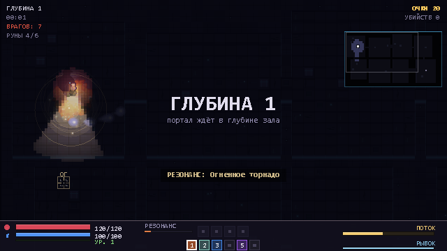

# AETHER SEQUENCE

Аркадная игра-рогалик на C# (.NET 10, WinForms + GDI+). Одиночный забег
в глубину на 15 уровней с боссами и дуэль на двоих по локальной сети.



## Скачать и играть

Готовая сборка — в разделе **[Releases](../../releases/latest)** или напрямую:

**[⬇ Скачать Aether Sequence v1.1 (zip, 46 МБ)](../../releases/download/v1.1/AetherSequence-v1.1.zip)**

Распакуйте архив и запустите `AetherSequence.exe`. Windows 10/11, ничего
доустанавливать не нужно — всё внутри одного файла.

Подробная инструкция по установке и игре лежит в архиве
(`КАК-ИГРАТЬ.txt`), она же продублирована ниже.

## Как играть вдвоём по сети

Оба компьютера должны быть в **одной сети** (домашний WiFi или кабель
к одному роутеру).

1. Хост: главное меню → **ДУЭЛЬ** → ник → **СОЗДАТЬ КОМНАТУ**.
2. Гость: **ДУЭЛЬ** → ник → **НАЙТИ КОМНАТЫ** → выбрать комнату → Enter.
3. Если список пустой (обычно мешает брандмауэр или «Общественная» сеть) —
   гость жмёт **ПОДКЛЮЧИТЬСЯ ПО IP** и вводит адрес, показанный на экране
   хоста. Это работает даже при закрытом брандмауэре.
4. Хост жмёт **СТАРТ**. Три победы — конец матча.

### Если комнаты не находятся

Самая частая причина — сеть помечена как «Общественная», и Windows блокирует
входящие пакеты:

- Параметры → Сеть и Интернет → Свойства сети → **Домашняя сеть** (на обоих ПК);
- запустить `Install.bat` от имени администратора — он пропишет правила
  брандмауэра;
- проверить, не включена ли в роутере «изоляция клиентов» (AP Isolation).

Диагностика сети одной командой:

```
AetherSequence.exe --netdiag
```

## Одиночный забег

15 глубин, каждая 5-я — боссовый этаж.

| Глубины | Тема | Босс |
|---|---|---|
| 1–4 | кристаллы | — |
| **5** | кристаллы | **СТРАЖ ЭФИРА** |
| 6–8 | токсичные пустоши | — |
| 9 | токсичные пустоши | — |
| **10** | костяные катакомбы | **ГНИЛОЙ КРОЛЬ** |
| 11–12 | костяные катакомбы | — |
| 13–14 | пепельные пустоши | — |
| **15** | пепельные пустоши | **ПЕПЕЛЬНЫЙ ГОЛЕМ** |

Смешивайте стихии подряд — срабатывает **резонанс** (сильный удар).

### Управление

| Действие | Клавиши |
|---|---|
| Ходьба | `WASD` / стрелки |
| Прицел | мышь |
| Каст | `ЛКМ` (зажать) |
| Рывок | `ПКМ` |
| Смена руны | `1`–`6`, колесо |
| Сброс комбо | `X` |
| Пауза / выход | `Esc` |

## Сборка из исходников

Нужен .NET SDK 10.0.

```bash
dotnet build -c Release

# один файл, готовый к раздаче
dotnet publish -c Release -r win-x64 --self-contained true \
  -p:PublishSingleFile=true \
  -p:EnableCompressionInSingleFile=true \
  -p:PublishReadyToRun=true \
  -p:DebugType=none \
  -o "dist/AetherSequence"
```

## Проверки и замеры

```bash
AetherSequence.exe --selftest   # тесты: забеги, боссы, сеть, дуэль
AetherSequence.exe --nettest    # реальный TCP-хост и клиент через loopback
AetherSequence.exe --frame      # разбор кадра по частям, цель 16.7 мс
AetherSequence.exe --perf       # детальный профиль рендера
```

`--frame` печатает, где уходит время:

```
часть A: только мир в буфер    2.7ms
часть B: растяжка на экран    11.0ms   <- потолок GDI+
часть C: только HUD            2.1ms
часть D: обновление игры       0.01ms
```

Растяжка мира с 640×360 на 1920×1080 — самая дорогая операция и она
задана самим GDI+. Поэтому в настройках есть «КАЧЕСТВО ГРАФИКИ»
(высокое/среднее/низкое): на слабых машинах это даёт плавные 60 FPS.

## Как устроено

```
AetherSequence/
  Art/        рендер: палитра, темы пещер, спрайты, свет, миникарта
  Audio/      синтез звука и музыки (NAudio, без внешних файлов)
  Combat/     заклинания, эффекты, снаряды, буфер стихий
  Core/       ввод, настройки, математика
  Entities/   игрок, враги, бонусы
  Forms/      окно и игровой цикл
  Game/       состояние игры, рендерер, сессия дуэли
  Net/        LAN-обнаружение, протокол, хост/клиент, бот
  Progression/ карты прокачки
  World/      генерация уровней
```

Сеть: discovery по UDP (47800), игра по TCP (47801). Хост — источник
истины, он же рассылает снимки состояния 30 раз в секунду.

Музыка и звуки синтезируются в рантайме, растровые анимации заклинаний
лежат в `Assets/Spells` и встраиваются в single-file сборку.
